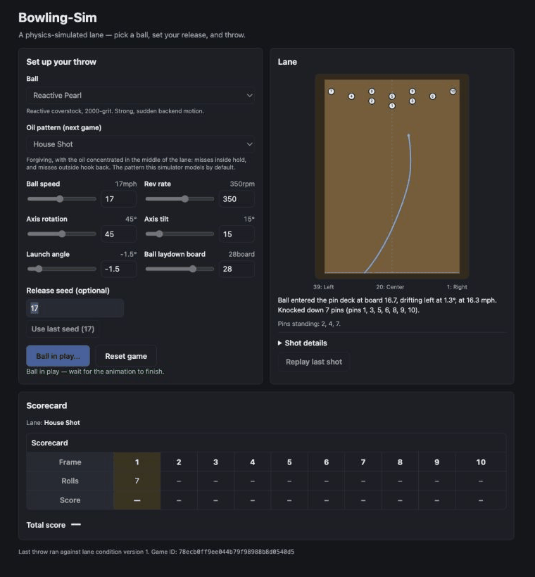

# Bowling-Sim

[](https://github.com/ethanschweiger/Bowling-Sim/actions/workflows/ci.yml)

Full-stack bowling simulator with a numerical ball-motion model, persistent
game state, deterministic pin collisions, and ten-pin scoring.



[Architecture](#architecture) · [Quick Start](#quick-start) ·
[Benchmarks](#benchmarks) · [API](docs/api.md)

**React + TypeScript | FastAPI | PostgreSQL | SQLAlchemy | Docker**

## Highlights

- Continuous skid → hook → roll simulation driven by friction and lateral slip
- Stateful lane oil and carrydown model, isolated per game
- Deterministic 2D ball/pin collisions, standing-pin racks, and ten-pin scoring
- Reproducible release variance through explicit seeds
- In-memory storage by default; opt-in PostgreSQL persistence through SQLAlchemy
- Dockerized frontend/backend/database and automated frontend/backend CI

## Architecture

```text
React + TypeScript
        │ REST/JSON
        ▼
FastAPI routes ──► GameService ──► in-memory or PostgreSQL repository
                        │
                        ├── numerical trajectory + stateful lane wear
                        ├── deterministic 2D pin collision + rack
                        └── ten-pin scorecard
```

The browser renders the server-recorded trajectory and game snapshot; it does
not re-run physics or scoring. The physics, collision, rack, and scoring layers
are independent of FastAPI and persistence. See
[docs/architecture.md](docs/architecture.md) for component boundaries,
transaction semantics, and concurrency details.

## Demo

The animation above is a real run of the app using release seed `17`. The API
simulates the path, resolves the pin collision, applies lane wear, advances the
rack and scorecard, and returns one authoritative snapshot for the frontend to
replay.

## Quick Start

Docker Desktop or Docker Engine with Compose v2 is the only prerequisite.

```bash
git clone https://github.com/ethanschweiger/Bowling-Sim.git
cd Bowling-Sim
docker compose up --build
```

Open [http://localhost:5173](http://localhost:5173). The API and interactive
OpenAPI docs are at [http://localhost:8000](http://localhost:8000) and
[http://localhost:8000/docs](http://localhost:8000/docs). No `.env` file or
database setup is required for the default in-memory mode.

```bash
docker compose down
```

For native Python/Node development, see
[docs/testing.md](docs/testing.md#native-development).

## How the Simulation Works

Each release starts with forward velocity and a bounded lateral-slip reservoir
derived from rev rate, axis rotation, axis tilt, coverstock, surface, RG, and
differential. Low friction in the oiled heads preserves that slip (skid); rising
friction converts it into lateral motion (hook); once it is spent, lateral
acceleration falls to zero (roll). The phases emerge from one integration loop
rather than from scripted distance thresholds.

Completed trajectories feed a separate deterministic planar collision model.
That model updates the immutable standing-pin rack, while standard ten-pin rules
advance the scorecard. See [docs/simulation.md](docs/simulation.md) for the model,
coordinate conventions, calibration evidence, and sourced-versus-assumed values.

## Persistence

The default mode keeps games in memory and requires no database. To exercise the
PostgreSQL adapter from a fresh clone:

```bash
docker compose \
  -f docker-compose.yml \
  -f docker-compose.sql.yml \
  up --build -d

docker compose \
  -f docker-compose.yml \
  -f docker-compose.sql.yml \
  exec backend alembic upgrade head

curl http://localhost:8000/health
# {"status":"ok","database":"ok"}
```

The named Postgres volume survives `docker compose down` and backend/container
restarts. Migrations remain explicit so schema changes never happen as a side
effect of starting the API. The exact create → throw → restart → read-back
verification is documented in [docs/persistence.md](docs/persistence.md).

## Testing

```bash
cd backend
source .venv/bin/activate
ruff check .
mypy app
python -m pytest -q

cd ../frontend
npm ci
npm run lint
npm run build
npm run test -- --run
```

The current suite contains **903 automated tests**: 603 backend and 300 frontend.
GitHub Actions runs backend Ruff, strict mypy, and pytest,
plus frontend lint, TypeScript/Vite build, and Vitest, on every push and pull
request. Test ownership and native setup are in
[docs/testing.md](docs/testing.md).

## Benchmarks

`benchmarks/benchmark_simulation.py` measures the pure 60-foot numerical
trajectory integration with 256 precomputed seeded releases. Setup, HTTP, JSON,
pin collision, scoring, lane wear, and database I/O are outside the timed region.

```bash
backend/.venv/bin/python benchmarks/benchmark_simulation.py --throws 10000
```

Latest recorded local result:

| Environment | Workload | Median | p95 | Throughput |
|---|---:|---:|---:|---:|
| Apple M3, macOS 15.7.4, Python 3.9.6 | 10,000 throws | 3.517 ms | 3.721 ms | 280.8 simulations/s |

Recorded August 30, 2026 with the production `0.05 ft` integration stride and
100 warmup throws. This is a development-machine measurement of the integrator,
not an end-to-end capacity claim. Reproduction details and caveats are in
[benchmarks/README.md](benchmarks/README.md).

## Design Decisions

- **Server-authoritative state.** The frontend formats a completed snapshot; it
  never derives a second score, rack, or trajectory.
- **Determinism before realism claims.** Seeds and fixed collision inputs make
  behavior reproducible while model limitations remain explicit.
- **Pure domain layers.** Physics and scoring import neither FastAPI nor
  SQLAlchemy, keeping them directly testable.
- **Optional persistence.** The zero-setup path stays in memory; PostgreSQL is a
  repository adapter, not a prerequisite for exploring the simulator.
- **Feature-frozen v1 scope.** This release receives correctness, security,
  documentation, and maintenance fixes—not new infrastructure layers.

More context is in [docs/design-decisions.md](docs/design-decisions.md).

## Limitations

- Ball and pin motion is a calibrated 2D approximation, not rigid-body 3D
  physics or a predictor of real pinfall counts.
- Oil patterns and release-error bounds are documented modeling assumptions,
  not certified patterns or measured bowler distributions.
- There are no accounts, authentication, player ownership, or multiplayer turn
  enforcement.
- SQL-mode coordination is process-local; a future multi-worker deployment
  would need database-level concurrency control.
- The Docker setup is for local evaluation, not an internet-facing production
  deployment.

See [docs/limitations.md](docs/limitations.md) for the complete boundary of the
model and application.

## Documentation

- [Architecture](docs/architecture.md)
- [Simulation and collision model](docs/simulation.md)
- [Persistence and SQL verification](docs/persistence.md)
- [API examples](docs/api.md)
- [Testing and CI](docs/testing.md)
- [Design decisions and frozen scope](docs/design-decisions.md)
- [Limitations](docs/limitations.md)
